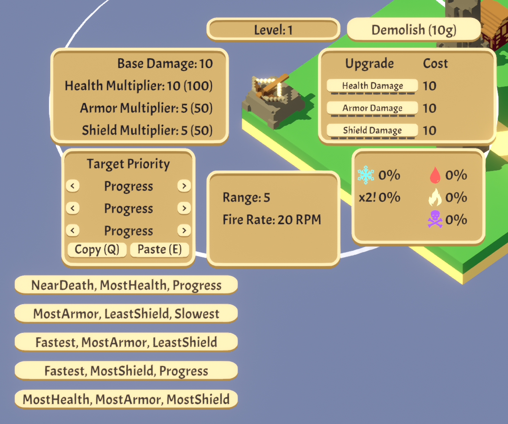

# FavoritePriorities Mod for Rogue Tower

FavoritePriorities is a mod that makes your life easier in Rogue Tower by allowing you to set up 5 quick-access buttons for priority combinations.

No more manually selecting each of the three priorities every time. With this mod, you can set all three priorities with a single click.
You can also toggle these quick-set buttons with a key press, making it faster to adjust your build strategy during runs.

## Installation

    Download the mod.

    Drag and drop the .dll file into your BepInEx/plugins folder.

    Run the game.

## Configuration

    On first launch, the mod will automatically generate a configuration file on BepInEx/conf folder.

    Here you can modify the default priorities assigned to each button and all the key bindings.

## Default Priorities:

    Priority1 = NearDeath,MostHealth,Progress
    
    Priority2 = MostArmor,LeastShield,Slowest
    
    Priority3 = Fastest,MostArmor,LeastShield
    
    Priority4 = Fastest,MostShield,Progress
    
    Priority5 = MostHealth,MostArmor,MostShield

## Default Key binds:

    PriorityKey1 = Alpha6

    PriorityKey2 = Alpha7

    PriorityKey3 = Alpha8

    PriorityKey4 = Alpha9

    PriorityKey5 = Alpha0

    TogglePanelKey = Tab

## Preview

