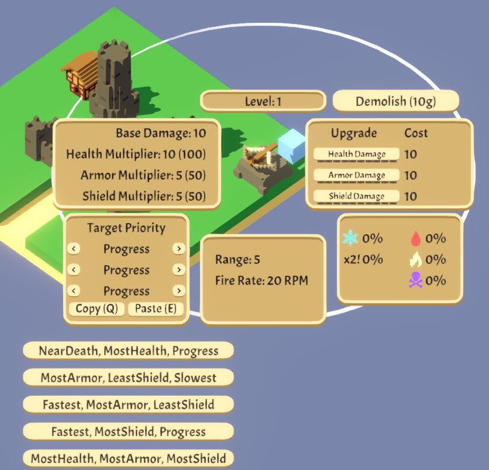

## FavoritePriorities Mod for Rogue Tower

FavoritePriorities is a mod that makes your life easier in Rogue Tower by allowing you to set up 5 quick-access buttons for priority combinations.

No more manually selecting each of the three priorities every time. With this mod, you can set all three priorities with a single click.
You can also toggle these quick-set buttons with a key press, making it faster to adjust your build strategy during runs.
Installation

    Download the mod.

    Drag and drop the .dll file into your BepInEx/plugins folder.

    Run the game.

On first launch, the mod will automatically generate a configuration file where you can:

    Change the default priorities assigned to each button.

    Modify the key bindings for quickly changing priorities.

    Enable or disable the in-game quick priority menu.

Default Key binds:

    Toggle menu: Tab

    Priority button 1: Alpha6

    Priority button 2: Alpha7

    Priority button 3: Alpha8

    Priority button 4: Alpha9

    Priority button 5: Alpha0

## Preview

